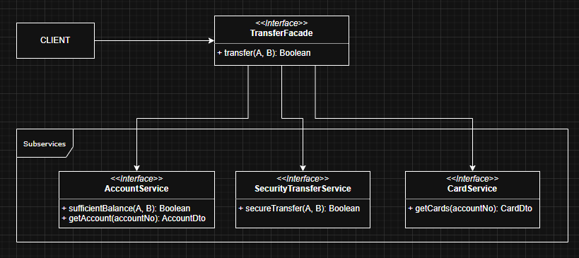

Facade Design Pattern

Facade Method Design Pattern
* The Facade Design Pattern provides a simplified interface to a complex subsystems.
*  Instead of the client dealing with many services or classes, it interfaces with just one Facade.
*  The Facade delegates calls to right underlying services.

 Design Considerations
 * Facade is a great solution to simplify dependencies. It allows you to have a weak coupling between subsystems.
 * If your only concern is coupling of client code to subsystem specific classes and not worried about simplification provided by a facade, then you can use abstract pattern in place of facade.

Implementation
   Imagine We have task to transfer money from A to B in the bank system. We have already many services that client must use so we can implement Facade Design Pattern called Transfer.
   
UML
   

   
